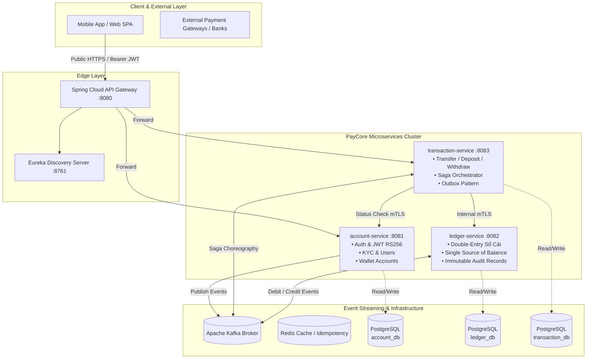

# 💳 PayCore — Enterprise Payment Platform Microservices

<p align="center">
  
  
  
  
  
  
  
  
</p>

---

## 📌 1. Project Overview

**PayCore** is an enterprise-grade fintech payment platform built using modern **Microservices Architecture**. It simulates real-world digital wallet systems (e.g., MoMo, ZaloPay) and payment gateways (e.g., Stripe, VNPay), focusing on mission-critical fintech challenges:

- 🛡️ **Strong Consistency & Double-Entry Bookkeeping**: Accurate, immutable balance management where money is never lost or duplicated.
- 🔑 **Fintech-Grade Authentication & Authorization**: Asymmetric **RS256 JWT**, BCrypt-12 hashing, refresh token rotation with theft detection, and brute-force lockout.
- ⚡ **Event-Driven Saga Pattern**: Choreography-based distributed transactions via Apache Kafka.
- 🔒 **Defense in Depth**: Database-per-service pattern, internal mTLS service-to-service routing, no sensitive credentials in plaintext.

---

## 🏛️ 2. Core Architecture & Microservices



---

## 💎 3. Services Roadmap & Status

| Service | Port | Database | Responsibilities | Status |
|---|---|---|---|---|
| 🔐 **`account-service`** | `8081` | `account_db` | Authentication (RS256), KYC status, User profiles, Wallet lifecycle, Token rotation | ✅ **Completed** |
| 🧭 **`eureka-server`** | `8761` | — | Dynamic service registration & discovery, health check monitoring | ✅ **Completed** |
| 🚪 **`api-gateway`** | `8080` | — | Single public entry point, RS256 JWT auth, Rate limiting, TraceId routing | ✅ **Completed** |
| 📖 **`ledger-service`** | `8082` | `ledger_db` | Double-entry bookkeeping, Balance single source of truth, Immutable journal entries | ✅ **Completed** |
| 💸 **`transaction-service`** | `8083` | `transaction_db` | Fund transfers, Deposit/Withdraw flows, Saga Orchestrator, Stuck Reaper, Outbox | ✅ **Completed** |
| 💳 **`payment-gateway-service`** | `8084` | `payment_db` | VNPay/MoMo/Stripe Adapters, Public Webhooks, Reconciliation Daemon, Outbox | ✅ **Completed** |
| 🛡️ **`fraud-service`** | `8085` | `fraud_db` | Real-time risk evaluation, rule engine, Redis velocity, blacklist fail-fast, review queue | ✅ **Completed** |
| 🔔 **`notification-service`** | `8086` | `notification_db` | Transaction alert notifications, email dispatch, push delivery | 🔄 Planned |

---

## 🛡️ 4. `account-service` Deep Dive

### 4.1 Security Specifications
- **Asymmetric RS256 Signing**: `account-service` exclusively manages the 2048-bit RSA Private Key to issue tokens. Downstream services verify tokens locally via the RSA Public Key without shared secrets.
- **Refresh Token Rotation (RTR)**: Every `/api/v1/auth/refresh` request revokes the old refresh token and issues a new pair.
- **Stolen Token Reuse Detection**: If a previously revoked token is presented, the system triggers an emergency protocol and revokes **all active tokens** for that user.
- **Hashed Storage**: Raw refresh tokens are never persisted in the database; only **SHA-256 digests** are stored.
- **Anti-Enumeration Protection**: Failed logins return a uniform message (`Email or password is incorrect`) to mitigate account discovery attacks.
- **Brute Force Lockout**: Accounts are automatically locked for 15 minutes after 5 consecutive failed attempts.

### 4.2 Database Schema (Flyway Versioned)
```
users (id, email, password_hash, full_name, phone_number, role, kyc_status, status, failed_login_attempts, ...)
accounts (id, user_id, account_number, currency, status, version, created_at, updated_at)
refresh_tokens (id, user_id, token_hash, expires_at, revoked, device_info, created_at)
```

---

## 📖 5. `ledger-service` Deep Dive

### 5.1 Architecture & Double-Entry Bookkeeping
- **Single Source of Truth**: All wallet balances across PayCore are projections computed and maintained exclusively by `ledger-service`.
- **Immutable Journal (`ledger_entries`)**: Append-only table with no `updated_at` column. Every transfer creates exactly 1 `DEBIT` and 1 `CREDIT` record.
- **System Suspense Accounts**: Dedicated suspense accounts (`SUSPENSE_VND`, `SUSPENSE_USD`) allow deposit and withdrawal flows from external payment gateways without violating double-entry symmetry.
- **Deterministic Pessimistic Locking**: Concurrent transactions lock account balances in ascending order (sorted UUIDs) via `SELECT ... FOR UPDATE`, guaranteeing deadlock-free processing.

### 5.2 2-Phase Idempotency Protocol
- **Phase 0 (`REQUIRES_NEW`)**: Validates SHA-256 payload hash, acquires atomic `PROCESSING` lock, or returns cached `COMPLETED`/`FAILED` responses.
- **Business Failure Preservation**: Insufficient balance errors (HTTP 422) are permanently stored in `idempotency_keys` in an isolated transaction so retries return identical failure snapshots without re-running logic.
- **Stale Lock Recovery**: If a worker crashes while in `PROCESSING` state for >30 seconds, subsequent requests reclaim the lock safely.

---

## 💸 6. `transaction-service` Deep Dive

### 6.1 Saga Orchestration & State Transitions
- **State Machine Transitions**:
  $$\text{PENDING} \longrightarrow \text{PROCESSING} \longrightarrow \begin{cases} \text{COMPLETED} & \text{(Fraud \& Ledger Success)} \\ \text{FAILED} & \text{(Fraud Reject or Insufficient Balance)} \\ \text{COMPENSATING} \longrightarrow \text{COMPENSATED} & \text{(External Gateway Failure on Withdraw)} \end{cases}$$
- **Fail-Closed Security**: Fraud service outages result in transaction rejection (`FRAUD_SERVICE_UNAVAILABLE`) rather than allowing potential fraud.
- **Audit Step Logging (`saga_logs`)**: Every individual saga transition (`INIT`, `FRAUD_CHECK`, `LEDGER_DEBIT_CREDIT`, `LEDGER_REVERSAL`, `NOTIFY`) is recorded with payload snapshots.

### 6.2 Deterministic Idempotency Key Derivation
- **Client-Facing Idempotency**: Managed via `Idempotency-Key` HTTP header with SHA-256 hash validation and 24-hour TTL snapshot caching.
- **Ledger Downstream Key**: Deterministic key formatting prevents double-execution on network retries or crashes:
  - Double-entry step: `{transactionId}:DEBIT_CREDIT`
  - Compensating reversal step: `{transactionId}:REVERSAL`

### 6.3 Stuck Transaction Reaper & Outbox Dispatcher
- **Stuck Reaper Daemon**: Periodically detects transactions stalled in `PENDING`/`PROCESSING`/`COMPENSATING` older than 2 minutes and safely resumes execution.
- **Transactional Outbox**: Emits `TransactionCompleted`, `TransactionFailed`, and `TransactionCompensated` events to Kafka topic `paycore.transaction-events`.

### 6.4 Public REST APIs (`/api/v1/transactions`)
- `POST /transfer` — Initiate P2P wallet transfer.
- `POST /deposit` — Top-up wallet from external payment gateway via system suspense account.
- `POST /withdraw` — Cash out wallet to external bank account with automatic compensation on gateway failure.
- `GET /{id}` — Retrieve complete transaction record with Saga audit trace.
- `GET /` — Paginated transaction history for the authenticated user.

---

## 💳 7. `payment-gateway-service` Deep Dive

### 7.1 Provider Adapter Pattern & Supported Gateways
- **Adapter Architecture**: Isolated `PaymentProviderAdapter` implementations for **VNPay** (HMAC-SHA512 `vnp_SecureHash`), **MoMo** (HMAC-SHA256 signature), and **Stripe** (`Stripe-Signature` timestamped HMAC).
- **Public Webhook Handling (`/webhooks/{provider}`)**:
  - Reads raw request bytes before JSON parsing.
  - Verifies cryptographic signature before doing any database mutations.
  - Returns HTTP 200 OK in all cases (including invalid signature or unknown transaction) to prevent gateway retry floods.
- **Unique Deduplication Layer**: Partial unique index `idx_webhook_dedup` on `(provider, provider_event_id)` stops duplicate webhook executions at the database level.
- **PCI-DSS Sensitive Data Masking**: `SensitiveDataMasker` masks card PANs (`4111********4444`) and CVV (`***`) before storing raw payloads into `webhook_events`.

### 7.2 Automated Reconciliation Engine
- **Background Daemon**: Periodically queries provider status APIs for transactions stalled in `PENDING_PROVIDER` (> 5 mins) to recover missed webhooks.
- **Expiration Worker**: Automatically marks transactions past `expires_at` (15 mins) as `EXPIRED` and dispatches `GatewayPaymentExpired` event.

### 7.3 Gateway APIs Reference
- `POST /internal/v1/gateway/deposit/initiate` — Initiates deposit and returns provider checkout URL.
- `POST /internal/v1/gateway/withdraw/initiate` — Dispatches payout order to banking provider.
- `POST /webhooks/{provider}` — Ingests external webhook notifications.
- `GET /webhooks/{provider}/callback` — Ingests user browser redirect callbacks.
- `GET /internal/v1/gateway/transactions/{id}/status` — Queries gateway transaction status.

---

## 🛡️ 8. `fraud-service` Deep Dive

### 8.1 Latency Budget & Real-Time Hot Path
- **Latency Budget Control**: Operates under strict caller deadline (< 2s) with an internal safety threshold of **1200ms**. If an internal step times out or encounters failure, gracefully falls back to `REVIEW` with reason code `INTERNAL_TIMEOUT_PARTIAL_CHECK`.
- **Redis-Accelerated Hot Path**:
  - **Deduplication (`dedup:{transactionId}`)**: 5-minute TTL; returns cached decision from `fraud_check_logs` without re-incrementing velocity counters on caller retries.
  - **Fail-Fast Blacklists**: O(1) Redis Sets for `blacklist:account`, `blacklist:device`, `blacklist:ip` (< 50ms fast reject).
  - **Sliding Velocity Counters**: Atomic Redis `INCR` with automated TTLs across `1min`, `1hour`, and `1day` sliding windows.
- **Dynamic In-Memory Rule Engine**: Configurable thresholds (`MAX_AMOUNT_PER_TX`, `VELOCITY_PER_MINUTE`, `LARGE_AMOUNT_REVIEW`) partitioned by KYC status (`PENDING` vs `VERIFIED`), synchronized dynamically via DB polling and Kafka topic `fraud.rules.updated`.

### 8.2 Manual Review Queue & Audit Logging
- **`fraud_check_logs`**: Comprehensive audit log recording decision, latency, evaluated rule snapshots, and admin resolution for regulatory compliance.
- **Review Queue APIs**:
  - `POST /internal/v1/fraud/check` — Synchronous risk evaluation API called by `transaction-service`.
  - `GET /internal/v1/fraud/review-queue` — Retrieves pending manual review transactions.
  - `POST /internal/v1/fraud/review-queue/{checkId}/decide` — Admin manual `APPROVE` or `REJECT` decision.
  - `POST /internal/v1/fraud/blacklist` — Blacklist entry management (instantly syncs DB & Redis Set).
  - `PUT /internal/v1/fraud/rules/{ruleCode}` — Dynamic rule threshold adjustments.

---

## 🚀 6. API Reference (`account-service`)

### Public Authentication Endpoints
- `POST /api/v1/auth/register` — Register user & automatically create default VND account.
- `POST /api/v1/auth/login` — Authenticate and receive `accessToken` (15m) + `refreshToken` (7d).
- `POST /api/v1/auth/refresh` — Perform refresh token rotation.
- `GET /api/v1/users/me` — Retrieve current profile (password hash omitted).
- `GET /api/v1/accounts/me` — Retrieve user's wallet accounts *(balance omitted by design)*.
- `POST /api/v1/accounts/{id}/freeze` — Freeze account *(Admin role required, publishes `AccountFrozen` event)*.

### Internal Inter-Service API (mTLS protected)
- `GET /internal/v1/accounts/{accountId}/status` — Real-time account status verification for `transaction-service`.

---

## 🧪 6. Automated Testing & Verification

PayCore enforces automated testing for every layer:

```bash
# Run the complete test suite
./mvnw clean test
```

### Test Coverage Highlights:
- **`JwtUtilTest`**: Validates RS256 token generation, signature integrity, custom claims, and tamper detection.
- **`AuthServiceTest`**: Comprehensive business flow testing covering duplicate handling, 5-attempt lockout, token rotation, and compromised token reuse detection.
- **`AccountServiceTest`**: Account status mutations, freeze operations, and event emissions.
- **`AuthControllerTest`**: Slice WebMvc tests verifying JSON payloads, validation errors, and standardized `ErrorResponse` formatting.
- **`AuthFlowIntegrationTest`**: End-to-end integration test verifying registration $\rightarrow$ login $\rightarrow$ authenticated profile query $\rightarrow$ token rotation $\rightarrow$ reuse detection $\rightarrow$ logout.

---

## 💻 7. Local Development Setup

### Prerequisites
- Java 21 LTS
- Docker & Docker Compose
- Maven 3.9+ (or use wrapper)

### Step 1: Clone Repository
```bash
git clone https://github.com/anhnhatdev/paycore.git
cd paycore
```

### Step 2: Generate RSA Keypair (for local dev)
```bash
mkdir -p account-service/src/main/resources/keys
openssl genrsa -out account-service/src/main/resources/keys/private.pem 2048
openssl rsa -in account-service/src/main/resources/keys/private.pem -pubout -out account-service/src/main/resources/keys/public.pem
```

### Step 3: Launch PostgreSQL Database
```bash
cd account-service
docker compose up account-db -d
```

### Step 4: Run the Service
```bash
../mvnw spring-boot:run -pl account-service -Dspring-boot.run.profiles=local
```

Access Swagger UI documentation at: **`http://localhost:8081/swagger-ui.html`**

---

## 🔔 9. Notification Service — Architecture & Idempotency Protocol

### Role
`notification-service` is a **pure Kafka consumer** — it never exposes public-facing REST endpoints, never holds financial data, and never calls `wallet-ledger-service` directly. Its sole job: receive domain events published by other services via Outbox Pattern, and deliver user notifications reliably and exactly once.

### Kafka Topics Consumed
| Topic | Published By | Events |
|-------|-------------|--------|
| `paycore.transaction-events` | `transaction-service` | `TransactionCompleted`, `TransactionFailed`, `TransactionCompensated` |
| `paycore.gateway-events` | `payment-gateway-service` | `GatewayPaymentSuccess`, `GatewayPaymentFailed`, `GatewayPaymentExpired` |
| `paycore.account-events` | `account-service` | `AccountFrozen` |

### 8-Step Idempotent Processing Protocol
Every incoming Kafka message is processed through a strict 8-step pipeline to guarantee **at-most-once delivery** despite Kafka's at-least-once semantics:

```
STEP 1: Receive message (eventId, eventType, payload) from Kafka
STEP 2: SELECT 1 FROM processed_events WHERE event_id = ?
        → If found: COMMIT OFFSET, RETURN (dedup hit)
STEP 3: @Transactional — INSERT processed_events + INSERT notifications (status=PENDING)
        → Both inserts ATOMIC; DB unique PK on event_id catches concurrent duplication
STEP 4: Check notification_preferences (user opted-out?)
        → If opted-out AND NOT non-optional security event: UPDATE status=SKIPPED_BY_PREFERENCE, RETURN
STEP 5: Resolve real contact (email/phone) from account-service /internal/v1/users/{id}/contact
STEP 6: Render template for (eventType × channel) → subject + body
STEP 7: Dispatch to NotificationProvider (Email / SMS / Push)
STEP 8: UPDATE notifications SET status=SENT|FAILED, attempt_count++, sent_at=NOW()
        COMMIT Kafka offset
```

### Non-Optional Security Events (Cannot Be Disabled by User)
The following event types ALWAYS trigger notification regardless of user preference settings. Attempting to disable them via `PUT /api/v1/notifications/preferences` returns `400 Bad Request`:

| Event Type | Reason |
|-----------|--------|
| `AccountFrozen` | Regulatory requirement — user must be informed of account restriction |
| `TransactionCompensated` | Financial impact — user money was returned; silence would cause confusion |
| `FraudReviewApproved` | Security decision finalized |
| `FraudReviewRejected` | Security decision finalized |

### PII Privacy & Masking
- **Real contact data** (email/phone) is resolved on-the-fly per request from `account-service`
- **Only masked values** are stored in `notifications.recipient_masked` and written to logs
  - Email: `john.doe@example.com` → `j******e@example.com`
  - Phone: `0901234567` → `090***4567`
- Raw PII is never written to the database or log files

### Retry & Dead-Letter Queue
- **First attempt** at dispatch time (Step 7)
- **Failed deliveries** → `status=FAILED`, retried by `NotificationRetryDaemon` with configurable interval
- **Max attempts exceeded** → `status=DEAD_LETTER`, event published to `paycore.notification.dead-letter`
- **Stuck PENDING recovery**: `StuckPendingRecoveryDaemon` scans for `status=PENDING` records older than 5 minutes (worker crash recovery) using `FOR UPDATE SKIP LOCKED`

### REST API Endpoints
| Method | Path | Description |
|--------|------|-------------|
| `GET` | `/api/v1/notifications/preferences` | Get all notification preferences for authenticated user |
| `PUT` | `/api/v1/notifications/preferences` | Update opt-in/opt-out per event type + channel (400 for non-optional) |
| `GET` | `/internal/v1/notifications/history/{userId}` | Audit delivery history (masked recipients only) |

### Test Coverage: 15/15 ✅
| Test | Scenario |
|------|---------|
| TEST-1 | Duplicate Kafka events → delivered exactly once (idempotency) |
| TEST-2 | User opt-out → `SKIPPED_BY_PREFERENCE` status |
| TEST-3 | `AccountFrozen` bypasses opt-out (non-optional security alert) |
| TEST-4 | Provider failure → `FAILED` status with error details |
| TEST-5 | Max retries exceeded → `DEAD_LETTER` transition |
| TEST-6 | Stuck PENDING recovery daemon query correctness |
| TEST-7 | Real email never stored in DB — only masked recipient persisted |

---

## ⚖️ 10. Reconciliation Service — Financial Integrity & Discrepancy Auditing

### Core Philosophy: Detect & Warn, NEVER Auto-Repair Money
`reconciliation-service` operates as an independent batch and auditing engine. Its purpose is to uncover financial and synchronization discrepancies across all microservices and external payment providers. Under zero circumstances is this service permitted to call write/update endpoints on `wallet-ledger-service` or alter account balances — all discrepancies require human investigation and audit logging.

### 4 Reconciliation Types
| Run Type | Frequency | Detection Target | Severity |
|---|---|---|---|
| `INTERNAL_PER_ACCOUNT` | Hourly | Checks stored account balance against double-entry ledger entries | `MEDIUM` |
| `INTERNAL_GLOBAL_INVARIANT` | Every 6h | Invariant verification: $\sum \text{DEBIT} == \sum \text{CREDIT}$ | `CRITICAL` |
| `CROSS_SERVICE` | Every 2h | Transaction Service COMPLETED $\leftrightarrow$ Ledger entries matching | `HIGH` |
| `EXTERNAL_GATEWAY` | Daily (T-1) | Succeeded gateway transactions $\leftrightarrow$ Provider settlement report (CSV) | `HIGH` / `CRITICAL` |

### Discrepancy Severity & Escalation Matrix
| Severity | Description | Alerting Action |
|---|---|---|
| `LOW` | Minor timing discrepancy | Internal structured log & dashboard |
| `MEDIUM` | Single account `BALANCE_MISMATCH` | Warning log, queued for ops shift review |
| `HIGH` | `MISSING_LEDGER_ENTRY`, `ORPHAN_LEDGER_ENTRY`, `GATEWAY_MISSING_INTERNAL_RECORD` | Immediate error alert (Ops team notification) |
| `CRITICAL` | `GLOBAL_INVARIANT_VIOLATION`, `GATEWAY_AMOUNT_MISMATCH` | Multi-channel broadcast, urgent on-call page |

### Discrepancy Deduplication & Idempotency
Executing the same reconciliation job twice over the same period updates the existing `OPEN` discrepancy record's `reconciliation_run_id` rather than inserting redundant rows.

### REST API Endpoints
| Method | Path | Description |
|---|---|---|
| `GET` | `/internal/v1/reconciliation/runs` | List reconciliation execution history |
| `POST` | `/internal/v1/reconciliation/trigger` | Trigger immediate on-demand reconciliation run |
| `GET` | `/internal/v1/reconciliation/discrepancies` | Query detected discrepancies by status, severity, or runId |
| `POST` | `/internal/v1/reconciliation/discrepancies/{id}/resolve` | Resolve discrepancy with operator ID & resolution note (Audit only) |
| `POST` | `/internal/v1/reconciliation/settlement/upload` | Upload and parse provider settlement CSV file |

### Test Coverage: 10/10 ✅
| Test | Scenario |
|---|---|
| TEST-1 | `INTERNAL_PER_ACCOUNT` detects balance mismatch |
| TEST-2 | `INTERNAL_GLOBAL_INVARIANT` passes with 0 discrepancies on balanced ledger |
| TEST-3 | `INTERNAL_GLOBAL_INVARIANT` flags 1 VND imbalance as `CRITICAL` |
| TEST-4 | `CROSS_SERVICE` identifies missing and orphan ledger entries |
| TEST-5 | `EXTERNAL_GATEWAY` identifies missing records and amount mismatches |
| TEST-6 | Idempotency / Dedup — repeated run updates existing `OPEN` discrepancy |
| TEST-7 | Resolution updates audit fields + Architectural Assertion (zero write calls to Ledger) |

---

## 🔒 11. Audit & Compliance Service — Tamper-Evident Immutable Event Ledger

### Role & Guarantees
`audit-service` provides an append-only, tamper-evident record of all security, financial, and operational events occurring across the PayCore platform. **No endpoint in this service is permitted to update or delete any audit record.**

### Cryptographic Hash Chaining (Blockchain-Style Tamper Evidence)
Every audit record computes a SHA-256 hash chaining to the preceding record:
$$\text{record\_hash} = \text{SHA256}(\text{prev\_hash} \parallel \text{event\_id} \parallel \text{payload} \parallel \text{occurred\_at} \parallel \text{sequence\_number})$$
- **Tamper Detection**: If any row or payload in the database is modified directly, recalculating the chain via `GET /internal/v1/audit/verify-chain` detects the exact corrupted sequence number.
- **Genesis Block**: Sequence #1 links to a 64-character zero genesis hash.
- **External Checkpoints**: Daily cryptographic checkpoints are generated and published externally for non-repudiation.

### Recursive Sensitive Payload Redaction
Before hashing and persistence, all event payloads undergo automated recursive traversal to redact sensitive fields into `"[REDACTED]"`:
- PAN / Card numbers (`cardNumber`, `pan`)
- CVV / CVC security codes (`cvv`, `cvv2`, `cvc`)
- Passwords & hashes (`password`, `passwordHash`, `pin`)
- One-time passwords (`otp`, `otpCode`)
- Cryptographic keys (`secretKey`, `privateKey`, `apiKey`)

### Mandatory Meta-Audit Access Logging
Every call to `GET /internal/v1/audit/records` automatically logs the operator's ID, search filters, and returned count into `audit_access_logs` for compliance oversight.

### RBAC Protection
Audit logs require explicit `COMPLIANCE` or `ADMIN` roles in gateway headers (`X-User-Role`). Unauthorized requests are rejected with `403 Forbidden`.

### REST API Endpoints
| Method | Path | Description |
|---|---|---|
| `GET` | `/internal/v1/audit/records` | Query audit trail with automatic meta-audit logging (Admin/Compliance only) |
| `GET` | `/internal/v1/audit/verify-chain` | Re-computes cryptographic hash chain to verify unbroken integrity |
| `GET` | `/internal/v1/audit/access-logs` | Review meta-audit access history (who queried audit records) |
| `POST` | `/internal/v1/audit/checkpoints` | Generate manual cryptographic checkpoint hash |

### Test Coverage: 12/12 ✅
| Test | Scenario |
|---|---|
| TEST-1 | Duplicate Kafka events result in exactly one audit record (idempotency) |
| TEST-2 | 5 sequential records maintain unbroken SHA-256 cryptographic hash chaining |
| TEST-3 | Simulated SQL database attack/tampering is detected with exact sequence number identified |
| TEST-4 | Sensitive card numbers, CVVs, and passwords in payload are redacted into `[REDACTED]` |
| TEST-5 | Mandatory meta-audit logging on every audit record search |
| TEST-6 | RBAC enforcement — unauthorized roles return `403 Forbidden` |
| TEST-7 | Archival daemon exports old partitions and leaves an `AuditPartitionArchived` audit trail |

---

## 📜 12. License & Author

- **Author:** [anhnhatdev](https://github.com/anhnhatdev)
- **Project:** PayCore Fintech Microservices Platform
- **License:** MIT License
