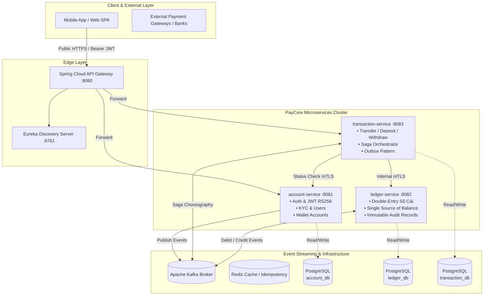

# 💳 PayCore — Enterprise Payment Platform Microservices

<p align="center">
  
  
  
  
  
  
  
  
</p>

---

## 📌 1. Project Overview

**PayCore** is an enterprise-grade fintech payment platform built using modern **Microservices Architecture**. It simulates real-world digital wallet systems (e.g., MoMo, ZaloPay) and payment gateways (e.g., Stripe, VNPay), focusing on mission-critical fintech challenges:

- 🛡️ **Strong Consistency & Double-Entry Bookkeeping**: Accurate, immutable balance management where money is never lost or duplicated.
- 🔑 **Fintech-Grade Authentication & Authorization**: Asymmetric **RS256 JWT**, BCrypt-12 hashing, refresh token rotation with theft detection, and brute-force lockout.
- ⚡ **Event-Driven Saga Pattern**: Choreography-based distributed transactions via Apache Kafka.
- 🔒 **Defense in Depth**: Database-per-service pattern, internal mTLS service-to-service routing, no sensitive credentials in plaintext.

---

## 🏛️ 2. Core Architecture & Microservices



---

## 💎 3. Services Roadmap & Status

| Service | Port | Database | Responsibilities | Status |
|---|---|---|---|---|
| 🔐 **`account-service`** | `8081` | `account_db` | Authentication (RS256), KYC status, User profiles, Wallet lifecycle, Token rotation | ✅ **Completed** |
| 🧭 **`eureka-server`** | `8761` | — | Dynamic service registration & discovery, health check monitoring | ✅ **Completed** |
| 🚪 **`api-gateway`** | `8080` | — | Single public entry point, RS256 JWT auth, Rate limiting, TraceId routing | ✅ **Completed** |
| 📖 **`ledger-service`** | `8082` | `ledger_db` | Double-entry bookkeeping, Balance single source of truth, Immutable journal entries | 🔄 Next |
| 💸 **`transaction-service`** | `8083` | `transaction_db` | Fund transfers, Deposit/Withdraw flows, Saga state machine, Outbox processor | 🔄 Planned |

---

## 🛡️ 4. `account-service` Deep Dive

### 4.1 Security Specifications
- **Asymmetric RS256 Signing**: `account-service` exclusively manages the 2048-bit RSA Private Key to issue tokens. Downstream services verify tokens locally via the RSA Public Key without shared secrets.
- **Refresh Token Rotation (RTR)**: Every `/api/v1/auth/refresh` request revokes the old refresh token and issues a new pair.
- **Stolen Token Reuse Detection**: If a previously revoked token is presented, the system triggers an emergency protocol and revokes **all active tokens** for that user.
- **Hashed Storage**: Raw refresh tokens are never persisted in the database; only **SHA-256 digests** are stored.
- **Anti-Enumeration Protection**: Failed logins return a uniform message (`Email or password is incorrect`) to mitigate account discovery attacks.
- **Brute Force Lockout**: Accounts are automatically locked for 15 minutes after 5 consecutive failed attempts.

### 4.2 Database Schema (Flyway Versioned)
```
users (id, email, password_hash, full_name, phone_number, role, kyc_status, status, failed_login_attempts, ...)
accounts (id, user_id, account_number, currency, status, version, created_at, updated_at)
refresh_tokens (id, user_id, token_hash, expires_at, revoked, device_info, created_at)
```

---

## 🚀 5. API Reference (`account-service`)

### Public Authentication Endpoints
- `POST /api/v1/auth/register` — Register user & automatically create default VND account.
- `POST /api/v1/auth/login` — Authenticate and receive `accessToken` (15m) + `refreshToken` (7d).
- `POST /api/v1/auth/refresh` — Perform refresh token rotation.
- `POST /api/v1/auth/logout` — Invalidate refresh token session.

### Authenticated User & Account APIs
- `GET /api/v1/users/me` — Retrieve current profile (password hash omitted).
- `GET /api/v1/accounts/me` — Retrieve user's wallet accounts *(balance omitted by design)*.
- `POST /api/v1/accounts/{id}/freeze` — Freeze account *(Admin role required, publishes `AccountFrozen` event)*.

### Internal Inter-Service API (mTLS protected)
- `GET /internal/v1/accounts/{accountId}/status` — Real-time account status verification for `transaction-service`.

---

## 🧪 6. Automated Testing & Verification

PayCore enforces automated testing for every layer:

```bash
# Run the complete test suite
./mvnw clean test
```

### Test Coverage Highlights:
- **`JwtUtilTest`**: Validates RS256 token generation, signature integrity, custom claims, and tamper detection.
- **`AuthServiceTest`**: Comprehensive business flow testing covering duplicate handling, 5-attempt lockout, token rotation, and compromised token reuse detection.
- **`AccountServiceTest`**: Account status mutations, freeze operations, and event emissions.
- **`AuthControllerTest`**: Slice WebMvc tests verifying JSON payloads, validation errors, and standardized `ErrorResponse` formatting.
- **`AuthFlowIntegrationTest`**: End-to-end integration test verifying registration $\rightarrow$ login $\rightarrow$ authenticated profile query $\rightarrow$ token rotation $\rightarrow$ reuse detection $\rightarrow$ logout.

---

## 💻 7. Local Development Setup

### Prerequisites
- Java 21 LTS
- Docker & Docker Compose
- Maven 3.9+ (or use wrapper)

### Step 1: Clone Repository
```bash
git clone https://github.com/anhnhatdev/paycore.git
cd paycore
```

### Step 2: Generate RSA Keypair (for local dev)
```bash
mkdir -p account-service/src/main/resources/keys
openssl genrsa -out account-service/src/main/resources/keys/private.pem 2048
openssl rsa -in account-service/src/main/resources/keys/private.pem -pubout -out account-service/src/main/resources/keys/public.pem
```

### Step 3: Launch PostgreSQL Database
```bash
cd account-service
docker compose up account-db -d
```

### Step 4: Run the Service
```bash
../mvnw spring-boot:run -pl account-service -Dspring-boot.run.profiles=local
```

Access Swagger UI documentation at: **`http://localhost:8081/swagger-ui.html`**

---

## 📜 8. License & Author

- **Author:** [anhnhatdev](https://github.com/anhnhatdev)
- **Project:** PayCore Fintech Microservices Platform
- **License:** MIT License
